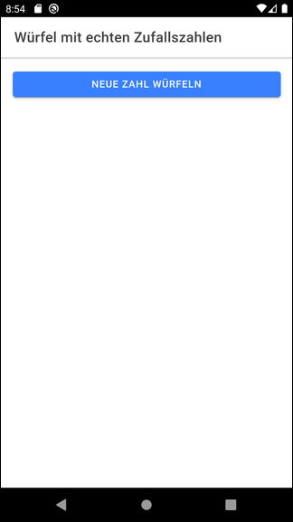
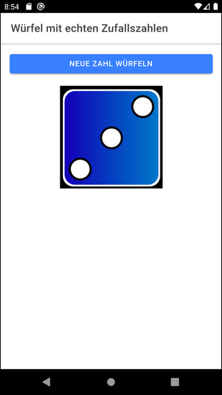

# Ionic: Würfel-App mit echten Zufallszahlen #

 

Die Ionic-App zeigt zufällige Würfelzahlen (Werte von 1 bis 6) an.  
Die Zufallszahlen werden von der Web-API [ANU QRNG](https://qrng.anu.edu.au/contact/api-documentation/) abgerufen,  
die echte Zufallszahlen generiert.

 

----

## Screenshots ##

 

 &nbsp; 

 

----

## License ##

 

See the [LICENSE file](LICENSE.md) for license rights and limitations (BSD 3-Clause License) for the files in this repository.

The author of this app is not related to *ANU QRNG*.

Illustration of dices used to display the random number cut out from [this image on *pixabay.com*](https://pixabay.com/de/illustrations/spiel-w%C3%BCrfel-dominospiel-1905965/) by [user peterolah0](https://pixabay.com/de/users/peterolah0-904688/). See [this Gist](https://gist.github.com/MDecker-MobileComputing/6ac576c3a512d2d462920b8e182beaa6) for the Bash script that was used to cut out the individual dices with ImageMagick.

 
