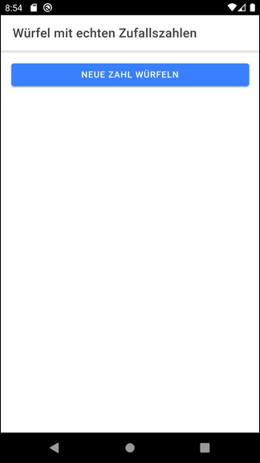

# Dice app based on real random data #

The Ionic app shows random dice numbers (values from 1 to 6).
The random numbers are fetched from the Web-API [ANU QRNG](https://qrng.anu.edu.au/contact/api-documentation/),
which generates real random numbers.

 

----

## Build as Electron app ##

Since the project is using [Capacitor](https://capacitorjs.com/) you can also build it as [Electron app](https://www.electronjs.org/).
For This, checkout [branch `electron`](https://github.com/MDecker-MobileComputing/Ionic_Wuerfel/tree/electron) of this repository and read the instructions in file [README_electron.md](https://github.com/MDecker-MobileComputing/Ionic_Wuerfel/blob/electron/README_electron.md).

 

----

## Screenshots ##

  

 

----

## License ##

See the [LICENSE file](LICENSE.md) for license rights and limitations (BSD 3-Clause License) for the files in this repository.

The author of this app is not related to *ANU QRNG*.

Illustration of dices used to display the random number cut out from [this image on *pixabay.com*](https://pixabay.com/de/illustrations/spiel-w%C3%BCrfel-dominospiel-1905965/) by [user peterolah0](https://pixabay.com/de/users/peterolah0-904688/). See [this Gist](https://gist.github.com/MDecker-MobileComputing/6ac576c3a512d2d462920b8e182beaa6) for the Bash script that was used to cut out the individual dices with ImageMagick.

 
